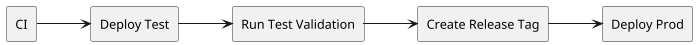

# CI/CD Workflow

This page explains the simplified release workflow used by the repository after
removing the Phase 1 "deploy also provisions and destroys everything" model from
the normal delivery path.

The key idea is simple:

- CI builds and validates
- `Deploy Test` updates the persistent `test` runtime
- `Run Test Validation` proves the deployed commit works end to end
- `Deploy Prod` promotes the same validated digest into the persistent `prod`
  runtime

Infrastructure provisioning still exists, but it is now a separate manual
Terraform concern rather than part of every code deploy.

## Flow Diagram

## Branch Model

- `develop` is the integration branch.
- `main` is the stable branch that can trigger automatic `test` deployment.
- `feature/*` work normally targets `develop`.
- `hotfix/*` may go directly to `main` as an exception, but must then be
  back-merged into `develop`.

## High-Level Flow

1. A pull request or push runs `CI`.
2. For deploy-relevant pushes to `develop` or `main`, CI builds deployable
   artifacts exactly once:
   - the ECS runtime image in the persistent `test` ECR repository
   - the MWAA deploy bundle
3. A successful deploy-relevant push to `main` triggers automatic `Deploy Test`.
4. `Deploy Test` updates the already-existing `test` runtime in AWS.
5. `Run Test Validation` is triggered separately and writes a compact result
   record to `s3://nyc-data-platform-test-artifacts/releases/test-runs/<commit_sha>.json`.
6. A release tag `vX.Y.Z` can later be created only for a commit already in
   `main`.
7. `Deploy Prod` checks CI success plus the `test` validation record, then
   promotes the exact validated digest into `prod`.

## Workflow Inventory

| Workflow | Trigger | Purpose |
|---|---|---|
| `CI` | PR, push to `develop` / `main` | validate code and build deployable artifacts |
| `Deploy Test` | `workflow_run` after successful `CI` on `main` | automatic runtime deploy into persistent `test` |
| `Deploy Test (Manual)` | manual dispatch | manual `test` runtime deploy for commits in `develop` or `main` |
| `Run Test Validation` | manual dispatch | run the cloud validation DAG for a deployed `test` commit |
| `Deploy Prod` | manual dispatch | promote a validated release tag into persistent `prod` |

The reusable `Deploy Test (Reusable)` workflow stays internal. Human operators
use the explicit entrypoints above.

## Deploy-Relevant Changes

CI always runs, but automatic `test` deployment is intentionally narrower.

Automatic `test` deployment is enabled only when the pushed commit changes at
least one deploy-relevant path:

- `airflow/**`
- `orchestration/**`
- `ingestion/**`
- `dbt/**`
- `infra/**`
- `.github/workflows/**`
- `tests/**`
- `docker-compose.yml`

Changes limited to documentation or exploratory material still receive CI, but
they do not automatically redeploy `test`.

## Artifact Contract

CI is the only stage allowed to build deployable artifacts.

For deploy-relevant pushes to `develop` or `main`, CI produces:

- an image pushed to the persistent `test` ECR repository
- a MWAA deploy bundle containing DAGs, requirements, and Python helper code
- CI metadata artifacts used to hand off context into deployment workflows

The image is tagged by commit SHA. The immutable image digest is the artifact
that later moves from `test` to `prod`.

`TRANSFORMATION_VERSION` is set to the same commit SHA so that the code version
and the deployment version stay aligned.

## Infrastructure Boundary

The deploy workflows now assume that `test` and `prod` already exist.

That means:

- no `terraform apply` inside `Deploy Test`
- no `terraform apply` inside `Deploy Prod`
- no destroy logic inside the normal code deployment path

If the runtime environment is missing or not healthy enough to accept code
updates, the deploy workflow fails clearly. Provisioning, repair, and teardown
remain manual Terraform operations outside the normal CI/CD flow.

## Deploy Test

Automatic `test` deployment runs only after:

- a successful CI run
- on a push to `main`
- for a deploy-relevant commit

Manual `test` deployment is also allowed, but only for commits that are already
contained in `develop` or `main`.

During deployment, the workflow:

1. downloads the CI-built deploy bundle
2. registers a new ECS task definition revision with the validated image
3. publishes DAGs, requirements, and plugins to the live MWAA artifact paths
4. updates MWAA runtime variables through the control-plane Lambda
5. runs a small smoke check to confirm the runtime is still healthy

The workflow does not run the full pipeline data validation itself.

## Run Test Validation

`Run Test Validation` is the explicit quality gate between `test` and `prod`.

It is separate from deploy on purpose:

- deploy answers "did the runtime update cleanly?"
- validation answers "does the deployed pipeline actually run correctly?"

The workflow uses the control-plane Lambda as a short-lived broker:

- one call prepares the MWAA runtime and triggers a unique DAG run
- repeated follow-up calls query the specific `run_id`
- GitHub Actions owns the long polling so the validation path is not limited by
  the 15 minute AWS Lambda ceiling

Each validation run uses an isolated S3 landing prefix under the `test`
environment root so repeated runs do not overlap.

The workflow writes a small machine-readable record to:

- `s3://nyc-data-platform-test-artifacts/releases/test-runs/<commit_sha>.json`

That record contains only the essentials:

- `commit_sha`
- `status`
- `workflow_run_url`
- `ci_run_url`
- `report_s3_uri`
- timestamp

`prod` promotion uses this record as the formal proof that a commit passed cloud
validation in `test`.

## Prod Promotion

`prod` is intentionally stricter than `test`.

The manual `prod` workflow accepts only a release tag in strict `vX.Y.Z`
format. Before promoting anything, it verifies that:

- the tag exists
- the tag points to a commit contained in `main`
- CI succeeded for that exact commit
- `releases/test-runs/<commit_sha>.json` exists
- the `test` validation record has `status = success`
- the validation record commit matches the tagged commit

Only then does the workflow:

1. promote the exact validated digest into the prod ECR repository
2. deploy the runtime update into the already-existing `prod` environment
3. perform a smoke check on the updated `prod` runtime
4. create or update the GitHub Release for the tag

`Deploy Prod` does not automatically run a full production data execution.

## GitHub Environments

The GitHub Environments model separates permissions by responsibility:

- `build`
  - variable: `AWS_ROLE_ARN`
- `test`
  - variable: `AWS_ROLE_ARN`
- `prod`
  - variable: `AWS_ROLE_ARN`
  - manual approval gate before deployment

This split keeps the CI build role narrower than the deploy roles and makes the
approval boundary for `prod` explicit.

## Wrapper Scripts

The repository includes four wrapper scripts for terminal-driven operation:

- `scripts/create-release-tag.sh`
- `scripts/deploy-test.sh`
- `scripts/run-test-validation.sh`
- `scripts/deploy-prod.sh`

These scripts:

- run local preflight checks for `gh`, `git`, and `jq`
- validate tags, commits, and branch ancestry
- dispatch the correct GitHub workflow
- watch the workflow until completion
- print the run URL and next useful action

There are also two repo-local execution scripts used inside GitHub Actions:

- `scripts/deploy-runtime.sh`
- `scripts/run-validation-pipeline.sh`

Those scripts hold the AWS runtime logic so the workflow YAML stays thin and the
real deploy behavior lives in versioned shell code rather than in long inline
workflow steps.
