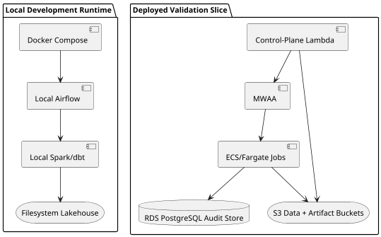

# Platform Components

This page is about responsibilities, not sequence. The pipeline page explains
what happens first, second, and third. This page explains which component owns
which job, and why the architecture is split that way.

## High-Level Component Map

The platform really has two operating modes. In `local`, almost everything is
collapsed into a developer-friendly stack because speed of iteration matters
more than strict infrastructure realism. In deployed environments, the same
logical pipeline is split across managed services so that orchestration,
execution, storage, and audit can be tested as independent concerns.

## Ingestion And Transformation Responsibilities

The ingestion layer begins in `ingestion/sources/`. Those files are not just
configuration clutter; they are the place where source-specific assumptions
live. They define where a dataset can be downloaded from, how its files are
named, and which deterministic landing path should be used once the object is
retrieved. That keeps source mechanics out of orchestration code and avoids
hard-coding TLC-specific rules throughout the rest of the platform.

Once a source has been resolved, the ingestion CLI does one narrow thing well:
it downloads a single monthly object into a predictable location and records
what it observed about that source. That narrow responsibility is deliberate.
The project wants ingestion to be explainable. If a later stage fails, the team
should still be able to answer whether the raw file was reached, where it was
stored, and what metadata was seen at the moment of retrieval.

The transformation side is built around `dbt`, with Spark underneath as the
execution runtime. That pairing is pragmatic. The transformations in this repo
are mostly relational and SQL-shaped, so dbt provides a clean dependency graph,
testing hooks, and a natural place to express contracts. Spark remains useful
because the project already models data movement and table building through a
Spark-backed path, and keeping that runtime in place avoids introducing a
second, unrelated execution engine too early.

## Why Airflow, MWAA, And ECS All Exist

This architecture uses more than one execution service because each one solves
a different problem.

**Airflow** is the orchestration layer. Its job is to know the order of work,
the dependencies between stages, and the conditions under which a run should be
marked successful or failed. Airflow is not there to be the data engine.

**MWAA**, which stands for **Amazon Managed Workflows for Apache Airflow**, is
AWS's managed version of Airflow. Instead of self-hosting the scheduler,
webserver, workers, and service plumbing, the project lets AWS run that control
plane. That makes MWAA the right place to validate a realistic deployed
orchestrator without taking on the full burden of operating Airflow ourselves.

**ECS/Fargate** is where stage work actually runs in the cloud slice. ECS is
AWS's container orchestration service, and Fargate is the serverless mode where
AWS runs those containers without requiring the project to manage EC2 nodes.
This matters because the heavy work in the pipeline is stage compute, not DAG
scheduling. By pushing `reference`, `ingestion`, `bronze`, `silver`, and
`gold` into ECS tasks, the architecture keeps the Airflow service lean and lets
the same container image be promoted from `test` to `prod` as an immutable
artifact. The ECR repositories that hold those images are treated as bootstrap
prerequisites rather than disposable per-run runtime resources.

## What The Control-Plane Lambda Does

The Lambda in this design is easy to misunderstand because it is not part of
the analytical path. It never transforms taxi data. Its job is operational.

Because the MWAA webserver is configured as `PRIVATE_ONLY`, the repo cannot
assume that a laptop outside the VPC can simply call the Airflow REST API and
manage runs directly. The control-plane Lambda solves that gap. It lives in the
VPC, can trigger a DAG run from inside the private boundary, poll the run, and
publish a final report without forcing the architecture to introduce a bastion
host or a permanently running administrative instance.

That is why the Lambda exists even though ECS already exists. ECS is for stage
compute. Lambda is for lightweight control-plane interaction.

## Why RDS And Secrets Manager Appear At All

RDS PostgreSQL is not the lakehouse and it is not the platform's analytical
store. The project keeps analytical data in S3-backed tables. RDS appears in
the cloud validation slice because run and deployment audit information is
naturally relational and because it lets the architecture validate integration
with a managed database without changing the lakehouse's core responsibilities.

Secrets Manager exists for a similar reason: it is not flashy, but it is part
of what makes a deployed environment feel real instead of improvised. Database
credentials, connection strings, and similar values should not be sprayed
through Terraform outputs or task definitions. Secrets Manager gives the ECS
tasks and Lambda a clean way to receive sensitive runtime values.

## Why S3 Is Split Into Multiple Buckets

One of the more important design choices is that S3 is not treated as one giant
bucket with every concern mixed together. There are separate buckets for
lakehouse data, orchestration artifacts, and Terraform state because those
things have different lifecycles.

Lakehouse data should survive repeated deploys and validation runs so that the
platform leaves evidence behind. Artifact buckets hold support assets for the
deployed environment, such as MWAA DAG files, dependency files, and reports.
Terraform state must outlive both `test` and `prod` activity because the system
needs a stable memory of which resources were created and later changed.
Splitting those concerns at the bucket level makes the environment easier to
reason about and safer to manage.

The same lifecycle split applies to ECR. The image registries must survive
repeated deploys because the workflow publishes an immutable digest once and
then promotes that exact digest from `test` to `prod`. That makes ECR part of
the bootstrap layer for this Phase 1 validation model, while MWAA, ECS, Lambda,
RDS, networking, logs, and runtime secrets stay inside the persistent runtime
environments that code deploys update.
