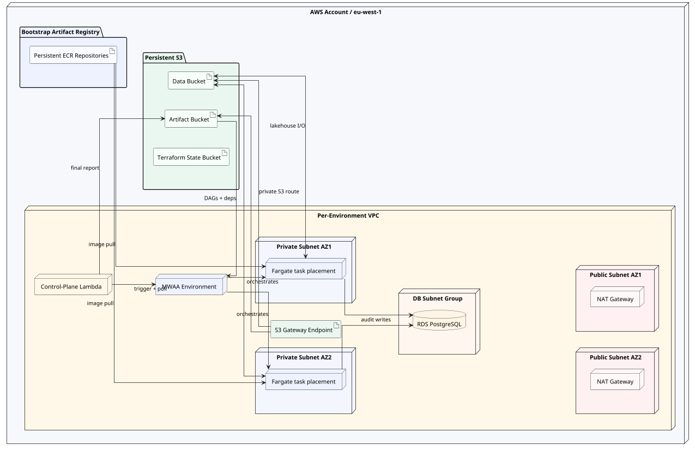

# Deployment Topology

This page explains the cloud shape of the deployed validation slice. It is not
trying to answer "what stage runs first?" The pipeline page already covers
that. The question here is different: where do the cloud components live, what
network boundaries separate them, and why was the topology designed this way?

The short answer is that the environment is intentionally more realistic than a
single test container, but still much smaller than a long-lived production
platform. `test` and `prod` use the same promoted image digest, and the normal
delivery path updates already-provisioned runtimes instead of rebuilding or
reprovisioning the whole environment for each code release.

## Cloud Deployment Diagram

## Start With The Network Boundary

The main network boundary in AWS is the **VPC**, or **Virtual Private Cloud**.
You can think of it as the private network envelope for one deployed
environment. In this project, each cloud environment gets its own VPC so that
`test` and `prod` are isolated not just by naming but by network boundary.

Inside a VPC, resources are placed into **subnets**. A subnet is simply a
smaller address range inside the VPC with its own routing behavior. Here the
important distinction is not the CIDR math but the routing role:

- **public subnets** are the places that can host NAT gateways
- **private subnets** are where the application services themselves run

The design uses both because the compute services should not sit directly in a
publicly reachable network segment. In the code, MWAA receives the list of both
private subnet IDs, the control-plane Lambda is attached to both private subnet
IDs, and each ECS task launch is given both private subnet IDs as placement
candidates. RDS is slightly different: the database subnet group spans both
private subnets, but the instance itself is configured as `multi_az = false`,
so it is still a single-AZ database instance.

## Why There Are Two AZs And Multiple Subnets

An **Availability Zone** is AWS's name for an isolated datacenter zone within a
region. Using two AZs means the environment is not tied to one single physical
failure domain. For a temporary validation slice this is admittedly more
realistic than strictly necessary, but it was a deliberate decision: the goal
was to test a cloud shape that resembles a serious deployment, not just the
cheapest possible topology.

That is why the VPC is split across:

- two public subnets, one per AZ
- two private subnets, one per AZ

In practice this gives the environment a symmetrical network layout. The NAT
gateways live in the public subnets. ECS tasks may be placed in either private
subnet because the task launch configuration passes both subnet IDs. MWAA is
also configured with both private subnets rather than being pinned to just one
box in one AZ. If the project had chosen a single-AZ design, the topology would
have been cheaper and simpler, but it would also have taught us less about how
the deployment behaves in a production-like shape.

## Why NAT And An S3 Endpoint Both Exist

The topology is intentionally **hybrid**. Most outbound traffic can use NAT,
but S3 traffic gets a dedicated **gateway endpoint**. An endpoint is a private
network path to an AWS service that avoids sending that traffic through the
general internet egress route.

This matters because S3 is not a secondary dependency in this platform; it is
the center of the data plane. The lakehouse lives there. MWAA artifacts live
there. Terraform state lives there. In the current Terraform code, S3 is the
only AWS service explicitly privatized with a VPC endpoint. That means S3 gets
a first-class private route, while the remaining outbound paths still rely on
NAT.

## What The Main Managed Services Are Doing

**MWAA** stands for **Amazon Managed Workflows for Apache Airflow**. In this
architecture it is the orchestration control plane. AWS runs the Airflow
service machinery, while the repo supplies the DAG logic. The environment is
configured as `PRIVATE_ONLY`, which means the Airflow webserver and REST API
are not intended to be driven directly from the public internet.

**ECS/Fargate** is the stage execution layer. ECS is AWS's container
orchestration service, and Fargate is the mode where the containers run without
the project having to manage EC2 hosts. These tasks are the real workers of the
pipeline: they bootstrap reference data, ingest the monthly file, and execute
the `bronze`, `silver`, and `gold` stages.

**Lambda** appears because `PRIVATE_ONLY` MWAA creates an operational gap: the
repo still needs something inside the VPC that can trigger a DAG run, poll it,
and publish a result. In the Terraform module it is attached to both private
subnets, so it should be understood as a VPC-level helper rather than "the
Lambda in AZ2". It fills that role cheaply and cleanly without introducing a
bastion or a permanently running admin instance.

**RDS PostgreSQL** is not the warehouse. It is used only as a lightweight audit
store for deployment and run metadata. Analytical data stays in the S3-backed
lakehouse. The current Terraform sets `multi_az = false`, so the instance is
single-AZ even though its subnet group spans both private subnets.

## Why S3 Is Split Into Three Roles

There are three distinct S3 concerns in this deployment model. The **data
bucket** holds the lakehouse layers such as `landing`, `bronze`, `silver`,
`gold`, `ops`, and `quarantine`. The **artifact bucket** holds MWAA DAG files,
requirements, and generated run reports. The **Terraform state bucket** stores
the infrastructure state that must survive across repeated `test` and `prod`
deployments.

Keeping those concerns separate is not busywork. It reflects different
lifecycles. Analytical outputs should survive routine code deploys. Deployment
support files belong to the environment but are not part of the analytical
model itself. Terraform state must remain stable even when infrastructure is
managed separately from the code delivery path.

The container registry follows the same lifecycle logic. The ECR repositories
are bootstrap resources that survive runs so the workflow can publish an image
once and then promote the same digest from `test` to `prod`.

## Promotion And Runtime Updates

```plantuml
@startuml
left to right direction
scale 0.76

rectangle "Build image once" as BUILD
rectangle "Push to test ECR" as TEST
rectangle "Run test validation" as VALIDATE
rectangle "Promote same image digest" as PROMOTE
rectangle "Copy digest to prod ECR" as PROD
rectangle "Update prod runtime" as RUNPROD

BUILD --> TEST
TEST --> VALIDATE
VALIDATE --> PROMOTE
PROMOTE --> PROD
PROD --> RUNPROD
@enduml
```

The promotion model is still based on **artifact promotion**, not rebuild, but
the normal delivery path now updates already-existing `test` and `prod`
runtimes. Infrastructure changes remain possible, but they are handled
explicitly outside the code deployment workflows rather than being coupled to
every release.
