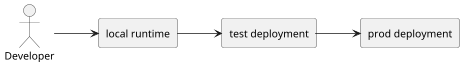

# Environment Model

The most important thing to understand about the environments in this repo is
that they are not three copies of the same thing. `local`, `test`, and `prod`
exist for different reasons, and the architecture is easier to understand once
that distinction is explicit.

## Runtime View

`local` is a developer runtime. It is where code is written, debugged, and
iterated on. It defaults to a filesystem-backed lakehouse under
`.local/lakehouse/local` because fast feedback and low risk matter more there
than infrastructure realism.

`test` is the first real deployment boundary. It exists to prove that the code
can survive packaging, AWS networking, secrets wiring, MWAA orchestration, and
ECS execution inside a real deployed environment. It is not just for
application logic. It is the integration point for the whole platform shape.

`prod` is intentionally close to `test`. The goal is not to maintain a second,
different code path. The goal is to validate promotion. `prod` receives the
same image digest and the same `TRANSFORMATION_VERSION` that already passed in
`test`. What changes is the environment boundary, not the logical artifact.

## Comparison At A Glance

| Environment | Type | Primary purpose | Default storage | Orchestration |
|---|---|---|---|---|
| `local` | developer runtime | build, debug, iterate | filesystem | local Airflow |
| `test` | deployed validation env | integration and promotion gate | S3 | MWAA |
| `prod` | deployed production-like env | final promoted validation slice | S3 | MWAA |

## Why The Split Works This Way

This split exists because one environment cannot optimize for every concern at
once. If `local` were forced to behave exactly like AWS on every run,
development would be slower and riskier than it needs to be. If `test` were
just another laptop-shaped runtime, the project would never truly validate its
deployment model. If `prod` rebuilt artifacts independently, promotion would
become harder to trust.

So the repo chooses a deliberate progression. Developers gain speed in `local`.
The platform shape is validated in `test`. That exact validated artifact is
then promoted into `prod`. The progression is simple enough to reason about but
still strong enough to catch environment-boundary problems.

## Promotion Rules

The promotion policy is intentionally strict. The same image digest moves from
`test` to `prod`. The same `TRANSFORMATION_VERSION` stays attached to that
artifact. The environments run in strict sequence rather than in parallel. And
the artifact is not rebuilt between environments.

Those rules may feel conservative, but they are what make the words "validated
in test" actually mean something. Without them, `prod` would only be loosely
related to the thing that was previously exercised.
