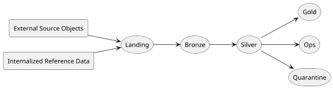

# System Overview

This platform exists to answer a practical data problem: build a reproducible
history of NYC taxi activity without making the system so heavy that every
change becomes expensive to test or reason about. The project focuses on batch
ingestion of TLC monthly trip files, shapes them into a small lakehouse, and
keeps enough operational metadata around each run to explain later why a
partition was ingested, skipped, or reprocessed.

Phase 1 is intentionally narrow. It covers yellow taxi trips, green taxi trips,
and the TLC taxi zone lookup as internal reference data. It does not try to be
everything at once: there is no streaming layer, no serving API, and no BI
product surface. The point of this phase is to prove that the core pipeline and
its deployment model are coherent before the platform grows more endpoints or
use cases.

## The Core Shape

The diagram is simpler than the real codebase on purpose. It shows the
fundamental contract of the system. Raw monthly files arrive in `landing`.
Managed raw data is established in `bronze`. Canonical analytical data is built
in `silver`. Consumer-facing datasets live in `gold`. Alongside that analytical
path, the platform writes operational observations into `ops` and isolates
problematic records in `quarantine` instead of silently dropping them.

The reason those layers exist is not only stylistic. `landing` gives us a
deterministic arrival area for files exactly as they were observed. `bronze`
puts those files under managed control with minimal interpretation. `silver`
becomes the first layer where the platform claims strong meaning about the
data: types are normalized, time fields are derived, joins to reference data
become stable, and quality rules become explicit. `gold` is where the shape of
the data is optimized for the questions analysts and operators actually ask.

## What Makes This Architecture Different

The platform is designed around one unit of work: a single `dataset-month` for
one taxi service. That constraint may look small, but it drives much of the
architecture. It means the system can talk precisely about whether `yellow
2018-01` is fresh, stale, missing, or needs replay because the transformation
logic changed. It also means the platform can re-run only the slices that need
attention instead of pretending that every issue requires a full historical
reload.

A second important trait is that the project separates **development runtime**
from **deployed environment**. `local` is where developers iterate. `test` and
`prod` are where the deployment model itself is validated. That separation is
useful because it keeps the fast feedback loop cheap while still allowing the
repo to prove that its AWS wiring, orchestration, and promotion logic work in a
real boundary.

The third distinguishing idea is that orchestration, compute, storage, and
audit are not collapsed into one service. Airflow is used to coordinate work,
not to become the compute engine. ECS tasks do the heavy stage execution. S3
holds the lakehouse. RDS is reserved for lightweight audit metadata in the
cloud validation slice. This division of responsibilities makes the system
easier to reason about when something goes wrong.

## Architecture Drivers

The design choices in this repo are mostly responses to a few non-negotiable
drivers:

| Driver | Why it matters | Resulting design choice |
|---|---|---|
| reproducibility | historical reruns must be explainable | transformation version + source metadata |
| recent analytics | most queries focus on short windows | Gold optimized for recent slices |
| stable geography | analysts need readable spatial keys | TLC zones as canonical geography |
| safe restatement | upstream republishes and code changes happen | stage ledger + reprocess signals |
| operational clarity | failures must be diagnosable by stage | layered stage execution and `ops` datasets |

If you read the rest of the architecture section with those five drivers in
mind, most of the implementation details become easier to understand. The
platform is not trying to be complicated for its own sake. It is trying to make
reprocessing, promotion, and operational diagnosis explicit from the start.
