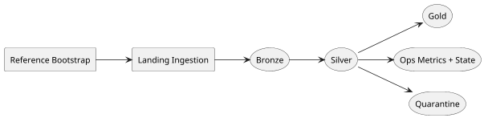

# Pipeline Execution

The platform processes data at **`dataset-month` granularity**. In practice,
that means one run is responsible for one service and one month, such as
`yellow 2018-01`. This is an important modeling choice, not just a naming
convention. It gives the platform a unit of work that is small enough to reason
about and explicit enough to re-run when either source metadata or
transformation logic changes.

## End-To-End Flow

The run begins with **reference bootstrap** because the platform wants internal
reference assets such as `taxi_zone_lookup` to enter the same managed world as
the external trip files. After that, **landing ingestion** retrieves the raw
monthly object from upstream and places it in a deterministic path. Once that
raw file is safely present, the medallion path takes over.

Rather than treating `bronze`, `silver`, and `gold` as isolated micro-topics,
it is more helpful to read them as one progressive refinement path. `bronze` is
where raw data becomes managed but is still minimally interpreted. `silver` is
where the platform starts making strong semantic claims: types are fixed, time
fields become canonical, joins to reference data are applied, and quality
signals become visible. `gold` is where those canonical models are shaped into
consumer-friendly facts and aggregates for operational analysis.

At the same time, the run writes to two side paths. `ops` captures source and
stage metadata so that the system can explain what happened during execution.
`quarantine` exists so that exceptional records can be isolated explicitly
instead of disappearing silently into logs or ad hoc filters.

## Operational Control Loop

```plantuml
@startuml
scale 0.42
participant Scheduler
participant Source
participant Landing
participant dbt
participant Ops

Scheduler -> Source: probe next candidate dataset-month
alt object exists
  Scheduler -> Landing: ingest monthly file
  Landing -> Ops: record source metadata
  Scheduler -> dbt: run bronze
  dbt -> Ops: record bronze state
  Scheduler -> dbt: run silver
  dbt -> Ops: record silver state
  Scheduler -> dbt: run gold
  dbt -> Ops: record gold state
else object missing
  Scheduler -> Scheduler: skip and retry later
end
@enduml
```

This operational loop is what keeps the pipeline from becoming a black box. The
scheduler does not only kick off transformations. It first determines whether
the expected upstream object exists. If it does, ingestion proceeds and the
platform records source metadata. Each later stage also leaves behind an
operational trace in `ops`, so the team can distinguish source issues from
transformation issues and stage-level regressions.

## Reprocessing And Replay

The system can mark a partition stale for two main reasons: the
`TRANSFORMATION_VERSION` changed, or the upstream source metadata changed in a
way that suggests the underlying file is no longer equivalent to the one seen
before. The important point is that replay is part of the designed behavior of
the platform, not an emergency escape hatch. The operational metadata is there
so that a re-run can be justified, not guessed.

## Local And Cloud Runtime

The execution model is logically the same in `local`, `test`, and `prod`, but
the runtime boundary is different. In `local`, Airflow and the stage runtime
stay close to the developer so that debugging is easy and storage defaults to
the filesystem. In deployed environments, Airflow becomes MWAA, stage compute
moves into ECS/Fargate, and storage becomes S3-backed. The purpose of that
shift is not to change the pipeline's meaning. It is to validate that the same
logical workflow can survive a real deployment boundary.
