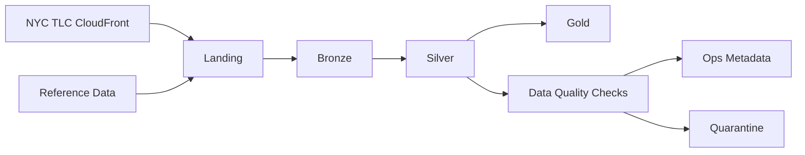

# NYC Urban Mobility Data Platform

!!! abstract "Scope"
    Documentation for the Phase 1 lakehouse platform focused on NYC urban mobility analysis.

## Documentation Map

### Architecture
- [Platform Overview](arch-phase1.md)
- [Repository Structure](repo-structure.md)

### ADR (Architecture Decision Records)
- [ADR-001 Ingestion Model](adr/001-ingestion-model.md)
- [ADR-002 Partitioning Strategy](adr/002-partitioning-strategy.md)
- [ADR-003 Schema Contracts](adr/003-schema-contracts.md)
- [ADR-004 Data Quality](adr/004-data-quality.md)
- [ADR-005 Data Governance](adr/005-data-governance.md)
- [ADR-006 Infrastructure as Code](adr/006-infrastructure.md)
- [ADR-007 Pipeline State Tracking](adr/007-pipeline.md)
- [ADR-008 Transformation Layer Implemented with dbt](adr/008-dbt-transformation-layer.md)
- [ADR-009 Environment Topology](adr/009-environment-topology.md)
- [ADR-010 Internal Reference Data and Geography](adr/010-reference-data-and-geography.md)
- [ADR-011 Reprocessing and Change Detection](adr/011-reprocessing-and-change-detection.md)
- [ADR-012 Data Quality Exception Handling](adr/012-data-quality-exception-handling.md)

### Discovery Notes
- [Taxi Dataset Discovery](exploration_notes/data-discovery-taxi.md)
- [Weather Dataset Discovery](exploration_notes/data-discovery-weather.md)

## Phase 1 Principles

- Deterministic ingestion at `dataset-month` granularity
- Canonical schema in Silver with explicit type normalization
- Layered governance (`landing -> bronze -> silver -> gold`)
- Observable pipelines through operational metadata (`ops`)
- Official TLC zones as Phase 1 physical geography
- Controlled restatement through transformation version and source metadata

## Architecture Flow

!!! tip "How to use this site"
    Start from the architecture overview, then read ADRs in numeric order.
    Use discovery notes as the evidence base for design decisions.
