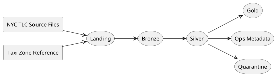

# NYC Urban Mobility Data Platform

!!! abstract "What this site is for"
    This documentation explains how the Phase 1 platform is structured, how the
    pipeline executes, and how the `local`, `test`, and `prod` environments fit
    together.

## Start Here

If you want to understand the platform quickly, read the pages in this order:

1. [System Overview](architecture/overview.md)
2. [Platform Components](architecture/components.md)
3. [Pipeline Execution](architecture/pipeline-execution.md)
4. [Deployment Topology](architecture/deployment-topology.md)
5. [Environment Model](architecture/environment-model.md)
6. [CI/CD Workflow](architecture/cicd.md)

## Platform At A Glance

## Core Ideas

- The platform ingests NYC TLC data at `dataset-month` granularity.
- `local` is a developer runtime, not a deployed environment.
- `test` and `prod` are the deployed AWS environments.
- The analytical path is layered: `landing -> bronze -> silver -> gold`.
- Operational control data lives in `ops`.
- Cloud validation uses MWAA for orchestration and ECS/Fargate for stage
  execution.

## Documentation Structure

### Architecture

- [System Overview](architecture/overview.md)
- [Platform Components](architecture/components.md)
- [Pipeline Execution](architecture/pipeline-execution.md)
- [Deployment Topology](architecture/deployment-topology.md)
- [Environment Model](architecture/environment-model.md)
- [CI/CD Workflow](architecture/cicd.md)
- [Repository Structure](repo-structure.md)

### ADRs

Use the ADR section for the design decisions behind the implementation.

### Discovery Notes

Use the discovery notes as the evidence base for source-level assumptions.

!!! tip "Reading mode"
    The architecture pages explain the system as it is meant to be understood.
    The ADRs explain why those choices were made.
